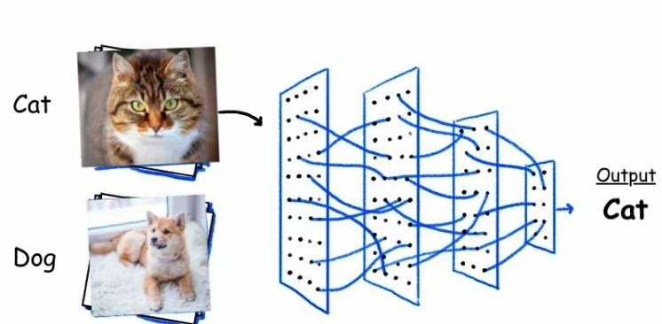
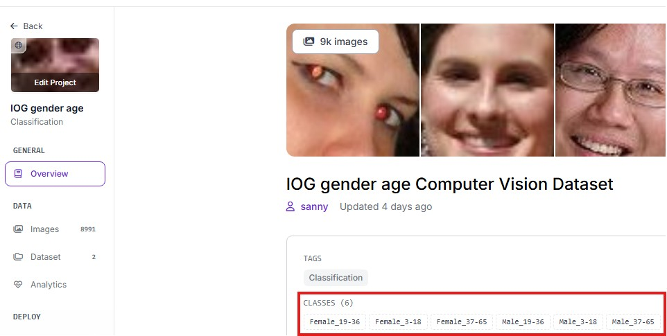

## Converting YOLO11 .onnyx to .cvimodel (REFERECE FROM SOPHGO SG2002)
[Original repo](https://github.com/AIWintermuteAI/maixcam-model-conversion?tab=readme-ov-file)
<br/>
[th](https://github.com/AIWintermuteAI/maixcam-model-conversion?tab=readme-ov-file)
<br/>
<br/>

<br/>
<br/>

#### 1. Build and Run Dockerfile
- Access the terminal from the root's project (Alternative IDE is preferable)


- Build Dockerfile
```
docker build -t tpu-mlir-dev:latest .
```
<br/><br/>

- Run the Docker image
```
docker run -it --name tpu_mlir_session tpu-mlir-dev:latest /bin/bash
```
<br/><br/>

#### 1. Model transformation

- For classification model you do not need to copy output_names "" from neutron simply removed it like below 
<br/>

- Make sure that input_shapes match imgz from your colab command


```
model_transform \
--model_name yolo_cls \
--model_def best.onnx \
--input_shapes [[1,3,224,224]] \
--mean 0.0,0.0,0.0 \
--scale 0.0039216,0.0039216,0.0039216 \
--pixel_format rgb \
--mlir yolo_cls.mlir
```
<br/><br/>

#### 2. Quantization calibration

- For calibration, use approximately 100 unlabeled images. These images must be specific to your model's target task (e.g., if you're detecting cars, use car images). The default face detection images in this repository should only be used if your model is a gender_age detector

```
run_calibration yolo_cls.mlir \
--dataset ./calibration_images_cls \
--input_num 100 \
-o yolo_cls_cali_table
```
<br/><br/>

#### 3. Conversion

- The last step is to convert the model into .cvimodel

```
model_deploy \
--mlir yolo_cls.mlir \
--quantize INT8 \
--calibration_table yolo_cls_cali_table \
--processor cv181x \
--model yolo_cls_int8_sym.cvimodel
```
<br/><br/>

#### 4. Edit model-cls.mud labels

- Open model-det and add your own labels. To view your labels navigate to the main page of the project to view the classes
<br/>

 
<br/>

- Edit the label accordingly
<br/>

 
<br/><br/>


#### 5. Final step, upload model and run script in Maixcam
- Connect to MaixCam using MaixVision IDE. Upload (model-cls.mud) and (yolov11n_cv181x_int8_sym.cvimodel) into MaixCam models directory
<br/>

 
<br/>

- Run the script classify.py

 

