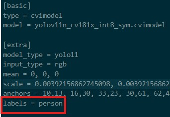

## Converting YOLO11 .onnyx model to .cvimodel REFERECE FROM SOPHGO SG2002 Model Conversion
[Original repo](https://github.com/AIWintermuteAI/maixcam-model-conversion?tab=readme-ov-file)
<br/>
[th](https://github.com/AIWintermuteAI/maixcam-model-conversion?tab=readme-ov-file)
<br/>
<br/>

<br/>
<br/>

<strong>1. Model transformation</strong>

- For detection model upload your onnyx file to (https://netron.app/) and place the name of the last convolutions in output_names "", Alternatively if you used yolov11 you can use this default command 
<br/>

- Make sure that input_shapes match imgz from your colab command

```
model_transform \
--model_name yolov11n \
--model_def best.onnx \
--input_shapes [[1,3,320,320]] \
--mean 0.0,0.0,0.0 \
--scale 0.0039216,0.0039216,0.0039216 \
--keep_aspect_ratio \
--pixel_format rgb \
--output_names "/model.23/Concat_output_0","/model.23/Concat_1_output_0","/model.23/Concat_2_output_0","/model.23/dfl/conv/Conv_output_0","/model.23/Sigmoid_output_0" \
--mlir yolov11n.mlir
```
<br/><br/>

<strong>2. Quantization calibration</strong>

- For calibration, use approximately 100 unlabeled images. These images must be specific to your model's target task (e.g., if you're detecting cars, use car images). The default face detection images in this repository should only be used if your model is a person detector

```
run_calibration yolov11n.mlir \
--dataset ./calibration_images-det \
--input_num 100 \
-o yolov11n_cali_table
```
<br/><br/>

<strong>3. Conversion</strong>

- The last step is to convert the model into .cvimodel
```
model_deploy \
--mlir yolov11n.mlir \
--quantize INT8 \
--calibration_table yolov11n_cali_table \
--processor cv181x \
--model yolov11n_cv181x_int8_sym.cvimodel
```
<br/><br/>

<strong>4. Edit model-det.mud labels</strong>

- Open model-det and add your own labels. To view your labels navigate to the main page of the project to view the classes
<br/>
 
<br/>

- Edit the label accordingly
<br/>
 
<br/><br/>


<strong>5. Final step, upload model and run script in Maixcam</strong>

- Connect to MaixCam using MaixVision IDE. Upload (model-det.mud) and (yolov11n_cv181x_int8_sym.cvimodel) into MaixCam models directory
<br/>
 
<br/>

- Run the script detect.py
 