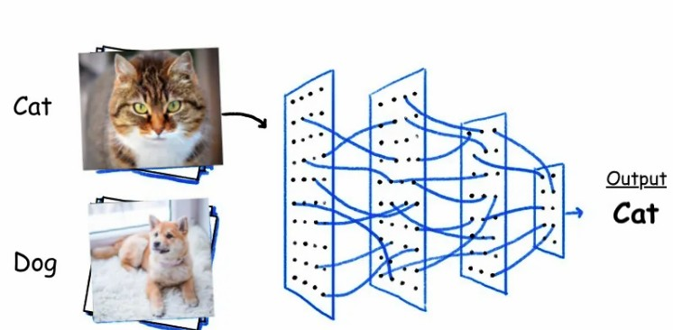
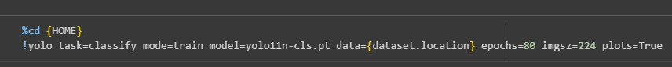
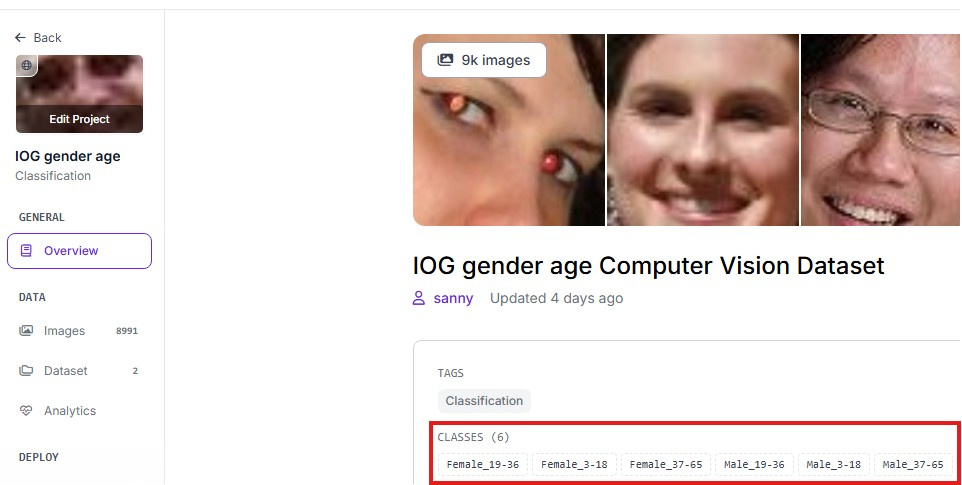
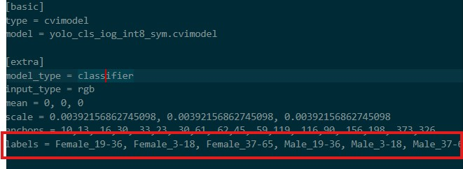
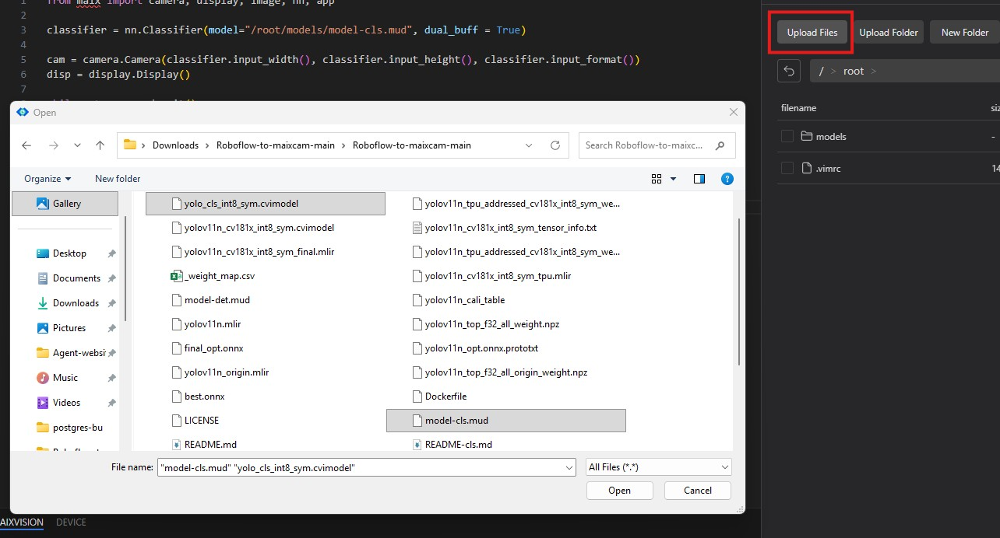
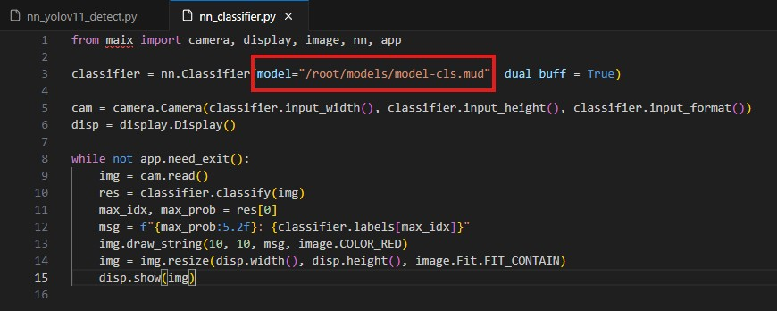

## การแปลง YOLOv11 .onnx เป็น .cvimodel (อ้างอิงจาก SOPHGO SG2002)
[Original repo](https://github.com/AIWintermuteAI/maixcam-model-conversion?tab=readme-ov-file)
<br/>
[en](https://github.com/San279/Roboflow-to-maixcam/blob/main/README-cls.md)
<br/>



<br/>
<br/>

#### 1. Build และ Run Dockerfile
- เข้าทอร์มินัลจากรูทโปรเจกต์ (แนะนำให้ใช้ IDE) ถ้าไม่มีใช้วิธีนี้ได้


- Build Dockerfile
```
docker build -t tpu-mlir-dev:latest .
```
<br/><br/>

- Run the Docker image
```
docker run -it --name tpu_mlir_session tpu-mlir-dev:latest /bin/bash
```
<br/><br/>

#### 1. การแปลงโมเดล (Model transformation)

- สำหรับ Classification Model คุณไม่จำเป็นต้องคัดลอก output_names "" จาก Neutron สามารถรัน command ได้เลย
<br/>

- อย่าลืม set ค่า input_shapes ให้ตรงกับ imgz จาก Google Colab



```
model_transform \
--model_name yolo_cls \
--model_def best.onnx \
--input_shapes [[1,3,224,224]] \
--mean 0.0,0.0,0.0 \
--scale 0.0039216,0.0039216,0.0039216 \
--pixel_format rgb \
--mlir yolo_cls.mlir
```
<br/><br/>

#### 2. การสอบเทียบค่าความละเอียด (Quantization calibration)

- ให้อัพโหลดใช้รูปภาพเหล่านี้ต้องเป็นภาพที่โมเดลจะได้เห็นตอน deploy ประมาณ 100 รูป (เช่น หากคุณกำลังตรวจจับรถยนต์ ให้ใช้รูปภาพรถยนต์) รูปภาพในแฟ้มนี้สามารถนำไปใช้ face classification เท่านั้น

```
run_calibration yolo_cls.mlir \
--dataset ./calibration_images_cls \
--input_num 100 \
-o yolo_cls_cali_table
```
<br/><br/>

#### 3. การแปลง (Conversion)

- ขั้นตอนสุดท้าย แปลงโมเดลเป็น .cvimodel

```
model_deploy \
--mlir yolo_cls.mlir \
--quantize INT8 \
--calibration_table yolo_cls_cali_table \
--processor cv181x \
--model yolo_cls_int8_sym.cvimodel
```
<br/><br/>

#### 4. แก้ไข labels ใน model-cls.mud

- เปิดไฟล์ model-cls และเพิ่ม labels ให้ตรงกับชุดข้อมูลจาก Roboflow หากต้องการดู labels ให้นำทางหน้าหลักของโปรเจกต์เพื่อดูคลาส
<br/>

 
<br/>

- แก้ไข labels ให้ เหมือนกัน
<br/>

 
<br/><br/>


#### 5. อัปโหลดโมเดลและรันสคริปต์

- เชื่อมต่อกับ MaixCam โดยใช้ MaixVision IDE อัปโหลดไฟล์ model-cls.mud และ (yolo_cls_int8_sym.cvimodel) ไปยังไดเรกทอรี models ของ MaixCam
<br/>

 
<br/>

- รันสคริปต์ classify.py

 

