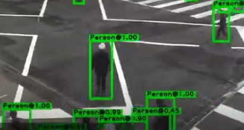
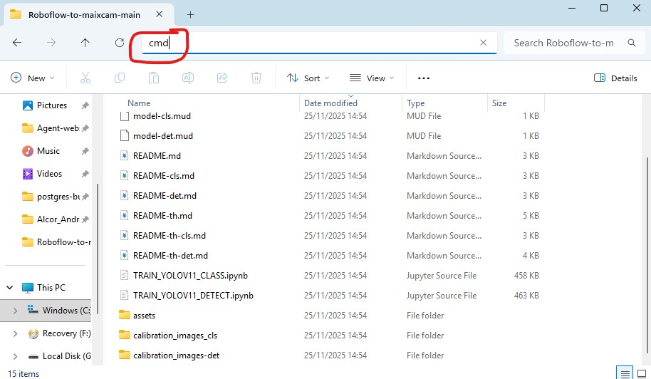
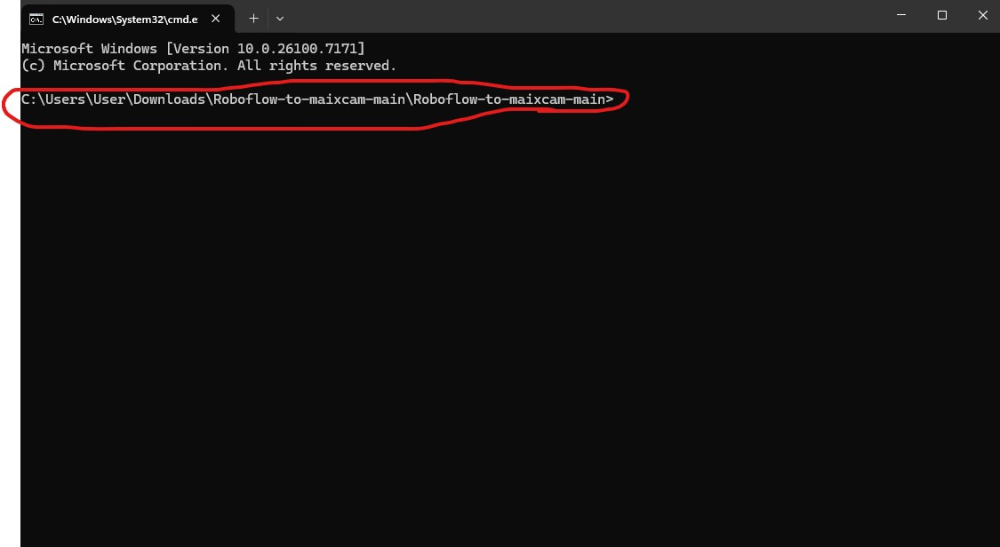
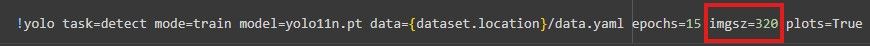
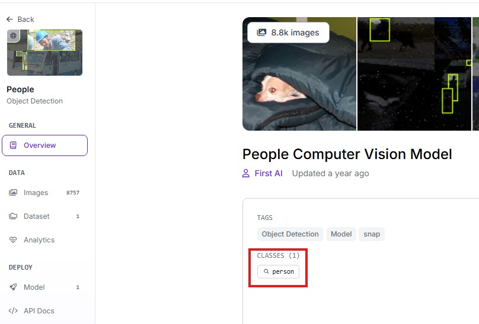
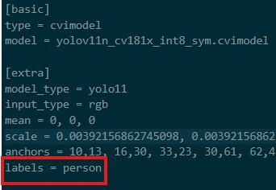
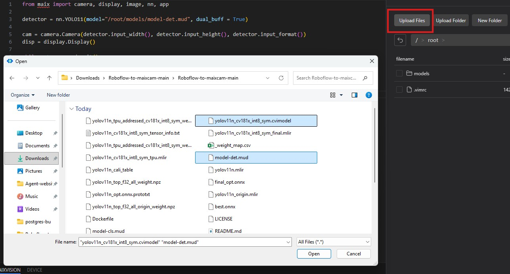
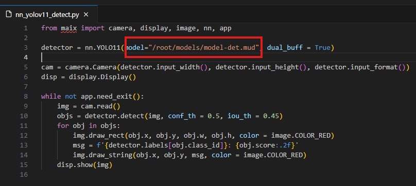

## Converting YOLO11 .onnyx to .cvimodel (REFERECE FROM SOPHGO SG2002)
[EN](https://github.com/San279/Roboflow-to-maixcam/blob/main/README-det.md)
<br/>
[Original repo](https://github.com/AIWintermuteAI/maixcam-model-conversion?tab=readme-ov-file)
<br/>
<br/>


<br/>
<br/>

#### 1. Build และ Run Dockerfile
- เข้าทอร์มินัลจากรูทโปรเจกต์ (แนะนำให้ใช้ IDE) ถ้าไม่มีใช้วิธีนี้ได้



- Build Dockerfile
```
docker build -t tpu-mlir-dev:latest .
```
<br/><br/>

- Run Docker สำหรับ windows's cmd
```
docker run -it --rm -v %CD%:/app tpu-mlir-dev:latest /bin/bash
```
- Run Docker สำหรับ linux terminal หรือ powershell
```
docker run -it --rm -v ${PWD}:/app tpu-mlir-dev:latest /bin/bash
```
<br/><br/>

#### 2. แปลง Model (Model transformation)

- สำหรับโมเดลตรวจจับวัตถุ ให้อัปโหลดไฟล์ .onnx ของคุณไปที่ https://netron.app/ และใส่ชื่อของ convolution ตัวสุดท้ายใน --output_names "" หรือใช้ YOLO11 สามารถใช้คำสั่งนี้ได้เลย 
<br/>

- อย่าลืม set ค่า input_shapes ให้ตรงกับ imgz จาก Google Colab



```
model_transform \
--model_name yolov11n \
--model_def best.onnx \
--input_shapes [[1,3,320,320]] \
--mean 0.0,0.0,0.0 \
--scale 0.0039216,0.0039216,0.0039216 \
--keep_aspect_ratio \
--pixel_format rgb \
--output_names "/model.23/Concat_output_0","/model.23/Concat_1_output_0","/model.23/Concat_2_output_0","/model.23/dfl/conv/Conv_output_0","/model.23/Sigmoid_output_0" \
--mlir yolov11n.mlir
```
<br/><br/>

#### 3. การสอบเทียบค่าความละเอียด (Quantization calibration)

- ให้อัพโหลดใช้รูปภาพเหล่านี้ต้องเป็นภาพที่โมเดลจะได้เห็นตอน deploy ประมาณ 100 รูป (เช่น หากคุณกำลังตรวจจับรถยนต์ ให้ใช้รูปภาพรถยนต์) รูปภาพในแฟ้มนี้สามารถนำไปใช้สำหรับตรวจจับผู้คนเท่านั้น

```
run_calibration yolov11n.mlir \
--dataset ./calibration_images-det \
--input_num 100 \
-o yolov11n_cali_table
```
<br/><br/>

#### 4. การแปลง (Conversion)

- ขั้นตอนสุดท้าย แปลงโมเดลเป็น .cvimodel

```
model_deploy \
--mlir yolov11n.mlir \
--quantize INT8 \
--calibration_table yolov11n_cali_table \
--processor cv181x \
--model yolov11n_cv181x_int8_sym.cvimodel
```
<br/><br/>

#### 5. แก้ไข labels ใน model-det.mud

- เปิดไฟล์ model-det.mud และเพิ่ม labels ให้ตรงกับชุดข้อมูลจาก Roboflow หากต้องการดู labels ให้นำทางหน้าหลักของโปรเจกต์เพื่อดูคลาส
<br/>

 
<br/>

- แก้ไข labels ให้ เหมือนกัน
<br/>

 
<br/><br/>


#### 6. อัปโหลดโมเดลและรันสคริปต์
- เชื่อมต่อกับ MaixCam โดยใช้ MaixVision IDE อัปโหลดไฟล์ model-det.mud และ (yolov11n_cv181x_int8_sym.cvimodel) ไปยังไดเรกทอรี models ของ MaixCam
<br/>

 
<br/>

- รันสคริปต์ detect.py

 


