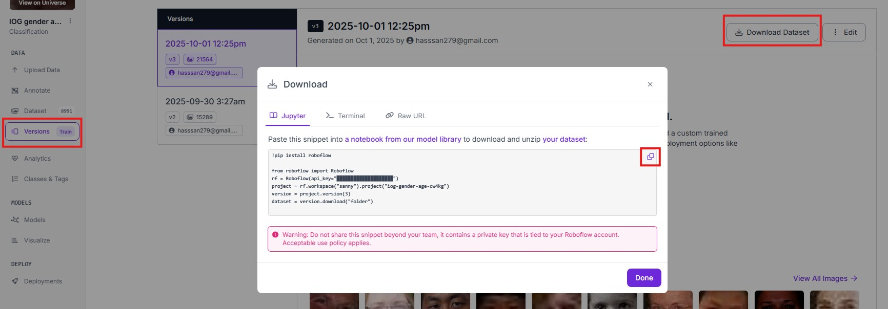

# คู่มือการฝึกโมเดลจาก Roboflow และการนำไปใช้งานบน MaixCAM
[EN](https://github.com/San279/Roboflow-to-maixcam)

# วีดิโอ Guide
[การฝีกโมเดล](https://www.youtube.com/watch?v=EtYPPXwuebw)
[การแปลง model และ Deploy](https://www.youtube.com/watch?v=oZhg0eqBP9s)

## ต้องมี
- บัญชี Google สำหรับใช้ Google Colab
- [Docker](https://www.docker.com/products/docker-desktop/)
- ชุดข้อมูล Roboflow ที่เลือกไว้
- MaixCAM

## ไฟล์โปรเจกต์
- Dockerfile - Docker image สำหรับแปลงโมเดล .onyx เป็น .cvimodel
- TRAINYOLOV11-detect - โน้ตบุ๊ก Colab สำหรับฝึกโมเดลตรวจจับวัตถุ (Object Detection)
- TRAINYOLOV11-cls - โน้ตบุ๊ก Colab สำหรับฝึกโมเดลการจำแนกประเภท (Classification)

## วิธีใช้โปรเจกต์

#### 1. 1. สำหรับการตรวจจับวัตถุ ให้ใช้ไฟล์ TRAINYOLOV11-detect สำหรับงานจำแนกประเภท ให้ใช้ไฟล์ TRAINYOLOV11-cls อัปโหลดไฟล์เหล่านั้นไปยัง Google Colab

#### 2. เปลี่ยน Runtime ใน Google Colab เป็น GPU


<br /><br /><br /><br />

#### 3.Copy ชุดข้อมูลจาก Roboflow และวางในเซลล์ที่สามของ Colab notebook
- Select version -> Download Dataset -> Show download code


<br /><br />

- วางโค้ดลงในเซลล์ที่สาม


<br /><br /><br /><br />

#### 4. ปรับ epoch และ imgz ตามที่ต้องการ
- epoch - จำนวน epoch ที่มากขึ้นมักจะเพิ่มความแม่นยำของโมเดล (แต่ไม่เสมอไป)
- imgz (ขนาดภาพ) การปรับขนาดภาพให้ใหญ่ขึ้นจะเพิ่มความแม่นยำให้โมเดล แต่ความเร็วในการประมวลผลจะช้าลง สำหรับโมเดลการจำแนกประเภทขั้นต้ำคือ 160 สำหรับโมเดลตรวจจับวัตถุ ให้ใช้ขนาด 300 ขึ้นไป ขนาดใหญ่ที่นิยมใช้คือ 320 และ 640
- ภาพมีตัวอย่างของการฝึกโมเดลจำแนกประเภทเป็นเวลา 80 epoch กับ loss 0.2 ซึ่งเทียบเท่ากับความแม่นยำประมาณ 80%
<br/>


<br /><br /><br /><br />

#### 5. รันเซลล์ที่เหลือเพื่อรับไฟล์ best.onnx และนำมาวางให้ในแฟ้มนี้ เพื่อใช้กับ Docker container สำหรับการแปลง
<br />

- รันเซลล์ที่เหลือเพื่อสร้างไฟล์ best.onnx


<br /><br />

- นำไฟลมาวางในแฟ้มนี้


<br /><br /><br /><br />

#### 6. รันคำสั่ง Docker ในไดเรกทอรีนี้เพื่อเริ่มการแปลงโมเดล
<br />
- Built Docker

```
docker build -t sophgo-mlir:v1.7 .
```
<br />
- run it

```
docker run -it --rm -v ${PWD}:/app sophgo-mlir:v1.7 /bin/bash
```
<br /><br /><br /><br />

#### 7. เลือกลิงค์เพื่ออ่านตู่มือแปลงโมเดล

7. ดูลิงก์เหล่านี้เพื่อดำเนินการต่อในโปรเจกต์การแปลงโมเดล
[สำหรับโมเดลตรวจจับวัตถุ](https://github.com/San279/Roboflow-to-maixcam/blob/main/README-th-det.md)
<br/>
[สำหรับโมเดลจำแหนกประเภท](https://github.com/San279/Roboflow-to-maixcam/blob/main/README-th-cls.md)
