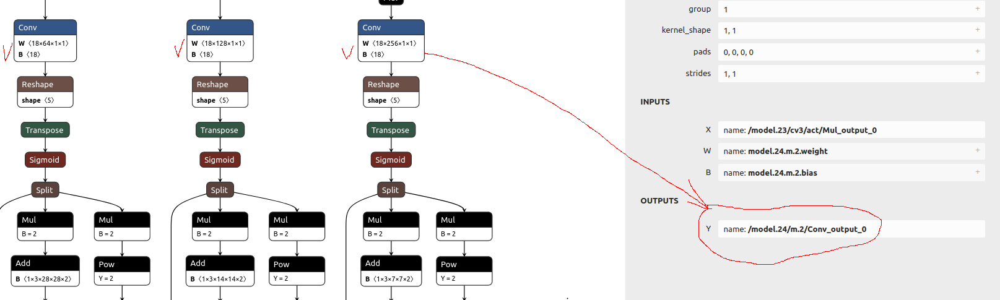

# Guide to train models from Roboflow and deploy in maixcam

<br/>
<br/>

## What you'll need
- Google account to use Google Colab
- Selected Roboflow dataset
- MaixCAM

## Project files descriptions
- Dockerfile - Docker image to convert .onyx model to .cvimodel
- TRAINYOLOV11-detect - Colab notebook for training an object detection model
- TRAINYOLOV11-cls - Colab note for traning a classification model

## How to use to project

<strong>1. For object detection tasks, use the TRAINYOLOV11-detect file. For classification tasks, use the TRAINYOLOV11-cls file.</strong>
<br /><br />

<br /><br /><br /><br />

<strong>2. Change runtime in google colab to GPU</strong>
<br /><br />

<br /><br /><br /><br />

<strong>3. Select a dataset from roboflow then paste the download code on the third cell</strong>
<br /><br />
- Select version -> Download Dataset -> Show download code 
<br/>

<br /><br />
- Place on on the third cell

<br /><br /><br /><br />

<strong>4. Adjust the epoch and imgz to your likings</strong>
<br /><br />
- epoch - More epoch generally increase model accuracy (not always)
- imgz generally leads to higher accuracy but slower processing speed. The default for classification models is 224. For detection tasks, use a minimum size of 300. Common larger sizes are 320 and 640.
- The image contain an example of a classification model train for 80 epoch with loss 0.2 which equates to around 80% accurate
<br/>

<br /><br /><br /><br />

<strong>5. Run the remaining cells to optain best.onynx. Download this directory and place the onnyx file to use it with docker container</strong>
<br /><br />
- Run the remaining cells to generate best.onnx
<br />

<br /><br />

<br /><br /><br /><br />

<strong>6. Run the following docker commands in this directory to begin the model conversion</strong>
<br /><br />
- Built the docker 
<br />
```
docker build -t sophgo-mlir:v1.7 .
```
<br /><br />
- run it
<br />
```
docker run -it --rm -v ${PWD}:/app sophgo-mlir:v1.7 /bin/bash
```

## Converting YOLO11 .onnyx model to .cvimodel REFERECE FROM SOPHGO SG2002 Model Conversion
[Original repo](https://github.com/AIWintermuteAI/maixcam-model-conversion?tab=readme-ov-file)

Example for Ultralitics YOLOv5.

## Step 1 Model transformation

- For detection model (https://netron.app/) and check the name of the last convolutions in your model. Place the results on output_names, Alternatively if you used yolov11 you can use this default command 



```
model_transform \
--model_name yolov11n \
--model_def best.onnx \
--input_shapes [[1,3,320,320]] \
--mean 0.0,0.0,0.0 \
--scale 0.0039216,0.0039216,0.0039216 \
--keep_aspect_ratio \
--pixel_format rgb \
--output_names "/model.23/Concat_output_0","/model.23/Concat_1_output_0","/model.23/Concat_2_output_0","/model.23/dfl/conv/Conv_output_0","/model.23/Sigmoid_output_0" \
--mlir yolov11n.mlir
```

## Step 2 Quantization calibration

Use some images from your dataset, about 100 is enough. They do not need to be labeled - but they need to be somewhat representative of the data the model will encounter later. In plain words - if you want to detect rabbits, feed pictures of rabbits for calibration, NOT the racoons.

```
run_calibration yolov5s.mlir \
--dataset testing \
--input_num 100 \
-o yolov5s_cali_table
```

## Step 3 Final deployment

As output you will get cvimodel file. You will need to create a simple model description file by yourself, just modify the example I have here (`model.mud`) and copy both files to MaixCam.

```
model_deploy \
--mlir yolov5s.mlir \
--quantize INT8 \
--calibration_table yolov5s_cali_table \
--processor cv181x \
--model yolov5s_cv181x_int8_sym.cvimodel
```