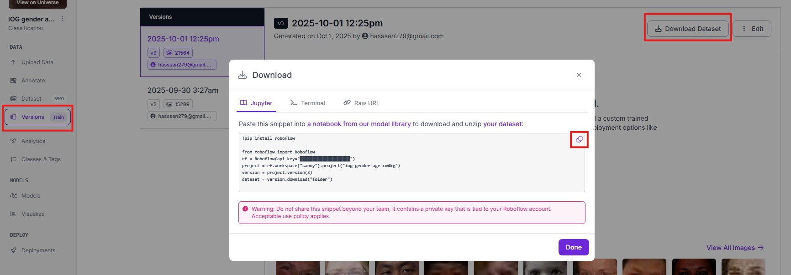

# Guide to train models from Roboflow and deploy in maixcam
## What you'll need
- Google account to use Google Colab
- Selected Roboflow dataset
- MaixCAM

## Project files descriptions
- Dockerfile - Docker image to convert .onyx model to .cvimodel
- TRAINYOLOV11-detect - Colab notebook for training an object detection model
- TRAINYOLOV11-cls - Colab note for traning a classification model

## How to use to project

#### 1. For object detection tasks, use the TRAINYOLOV11-detect file. For classification tasks, use the TRAINYOLOV11-cls file. Upload them to Google Colab

#### 2. Change runtime in google colab to GPU


<br /><br /><br /><br />

#### 3. Select a dataset from roboflow then paste the download code on the third cell
- Select version -> Download Dataset -> Show download code


<br /><br />
- Place on on the third cell


<br /><br /><br /><br />

#### 4. Adjust the epoch and imgz to your likings
- epoch - More epoch generally increase model accuracy (not always)
- imgz generally leads to higher accuracy but slower processing speed. The default for classification models is 224. For detection tasks, use a minimum size of 300. Common larger sizes are 320 and 640.
- The image contain an example of a classification model train for 80 epoch with loss 0.2 which equates to around 80% accurate
<br/>


<br /><br /><br /><br />

#### 5. Run the remaining cells to optain best.onynx. Download this directory and place the onnyx file to use it with docker container
<br />
- Run the remaining cells to generate best.onnx


<br /><br />


<br /><br /><br /><br />

#### 6. Run the following docker commands in this directory to begin the model conversion
<br />
- Built the docker

```bash
docker build -t sophgo-mlir:v1.7 .
```
<br />
- run it

```bash
docker run -it --rm -v ${PWD}:/app sophgo-mlir:v1.7 /bin/bash
```
